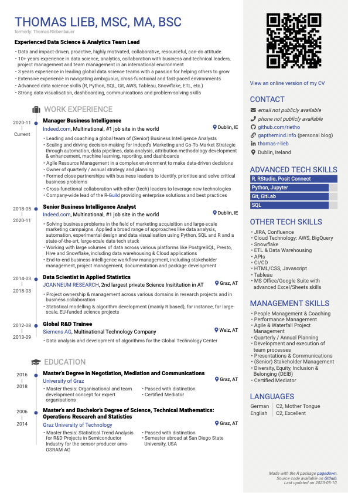

# My CV created using R

This CV is generated using the R package
[pagedown](https://rstudio.github.io/pagedown/), which uses the
JavaScript library [paged.js](https://www.pagedjs.org/). This allows
creating a CV based on R Markdown using markdown and HTML making it very
flexible.

In addition, this CV is based on pretty much all content being stored in
a Google Sheet, thus separating content and styling.

Here’s an example of how my CV looks like:

## Acknowledgements

This CV was created based on the
[`datadrivencv`](http://nickstrayer.me/datadrivencv/) R package.

# Motivation

I wanted to update my CV, but editing a document/slide is quite a bit of
manual work. That is especially as this can easily lead to re-formatting
the whole file. I remembered that some people were doing CVs using
Rmarkdown. On researching, I came across the
[`datadrivencv`](http://nickstrayer.me/datadrivencv/) package. That
seemed like a great approach as it allows me to:

- Store the content in a file making it easy to edit.
- Change the style using CSS.
- Easily create HTML and PDF versions.
- The `datadrivencv` package creates the needed files based on
  templates. After that my CV does not depend on the package.
- Use R (I like using R).

# Using it

Feel free to re use what I created. I made a bunch of customisations
compared to what `datadrivencv` gives you. I’m planning to write a blog
post about that on my blog <https://gapthemind.info>

You might fork my repo, copy my spreadhseet, fill it with your own data
and with that render your own CV.

## Format of spreadsheets

The data is stored in a [Google
Sheet](https://docs.google.com/spreadsheets/d/1KcTSyanKHQ1jGnwVd6AxMcb3zXLvt-2RKzsPOfmI5Cw/edit#gid=917338460)

There are four spreadsheets of “data” that are used. These take the form
of separate sub-sheets within a google sheet. The four spreadsheets that
are needed and their columns are:

### `entries`

| Column          | Description                                                                                                                                            |
|-----------------|--------------------------------------------------------------------------------------------------------------------------------------------------------|
| `section`       | Where in your CV this entry belongs                                                                                                                    |
| `title`         | Main title of the entry                                                                                                                                |
| `loc`           | Location the entry occured                                                                                                                             |
| `institution`   | Primary institution affiliation for entry                                                                                                              |
| `start`         | Start date of entry (year). Can be left blank for single point events like a manuscript.                                                               |
| `end`           | End year of entry. Set to “current” if entry is still ongoing.                                                                                         |
| `description_*` | All description columns are pasted togehter. You can include markdown and html formatting in here. A cell starting with `<exclude>` is not considered. |
| `in_resume`     | A filter variable that is used to decide if entry is in the resume.                                                                                    |

### `skills`

| Column      | Description                                                                        |
|-------------|------------------------------------------------------------------------------------|
| `order`     | Order                                                                              |
| `category`  | Category of skill. Currently one of: technical, language, other_tech or attributes |
| `skill`     | Name of skill                                                                      |
| `level_num` | Relative numeric level of skill. Applies only to category “technical”              |
| `level_cat` | Categorical level of skill. Applies only to categoriy “language”                   |
| `in_resume` | A filter variable that is used to decide if entry is in the resume.                |

### `text_blocks`

| Column | Description                                           |
|--------|-------------------------------------------------------|
| `loc`  | Id used for finding text block                        |
| `text` | Contents of text block. Supports markdown formatting. |

### `contact_info`

| Column    | Description                                                 |
|-----------|-------------------------------------------------------------|
| `loc`     | Id of contact section                                       |
| `icon`    | Icon used from font-awesome 4 to label this contact section |
| `contact` | The actual value written for the contact entry              |
| `link`    | An optional link for the contact entry                      |

# Rendering your CV

Now that you have the templates setup and you’ve configured your data,
the last thing to do is render. The easiest way to do this is by opening
`cv.rmd` in RStudio and clicking the “Knit” button. This will render an
HTML version of your CV. However, you most likely want a PDF version of
your CV to go along with an HTML version. The easiest way to do this is
to run the included script `render_cv.r`:

### `render_cv.r`

This script will render your CV in HTML and output it as `cv.html`, it
will also turn on the `pdf_mode` parameter in `cv.rmd`, which will strip
the links out and place them at the end linked by inline superscripts.
Once the pdf version is rendered to HTML, it will then turn that HTML
into a PDF using `pagedown::chrome_print()`. By using this script you
can easily make sure your get both versions rendered at the same time
without having to manually go in and toggle the pdf mode parameter in
the yaml header and then use the print dialog in your browser.
